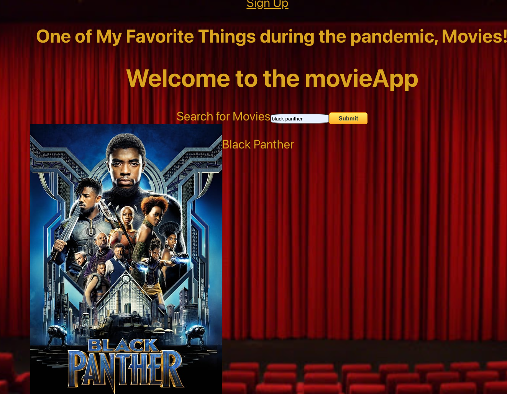
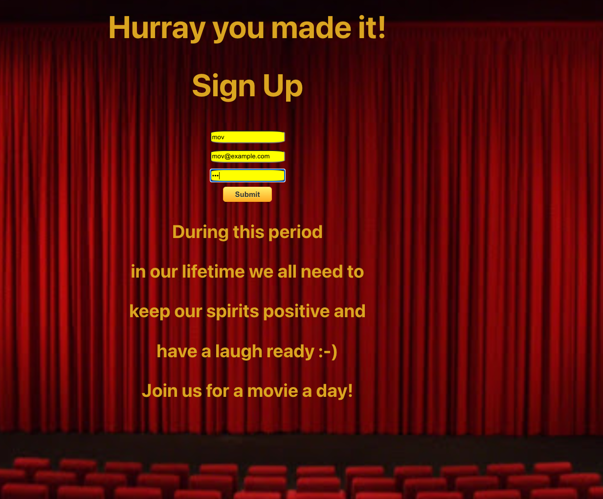
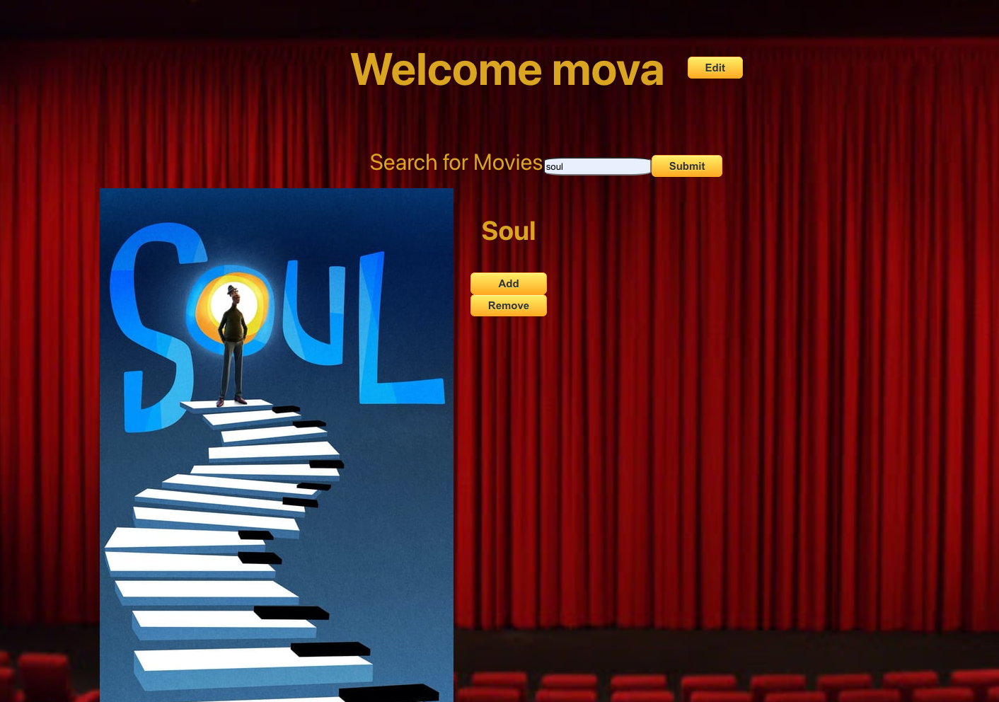
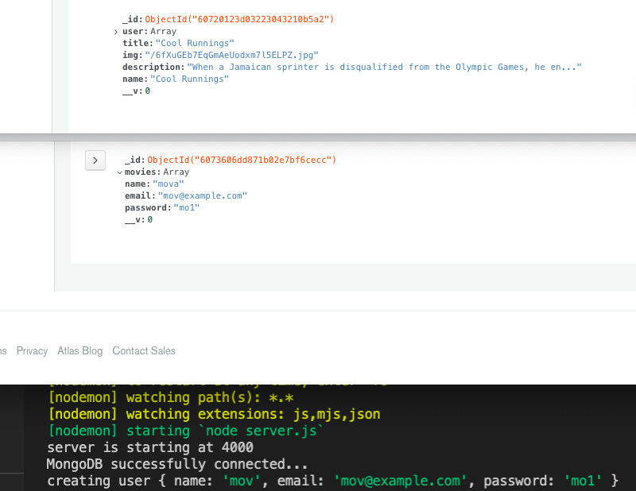
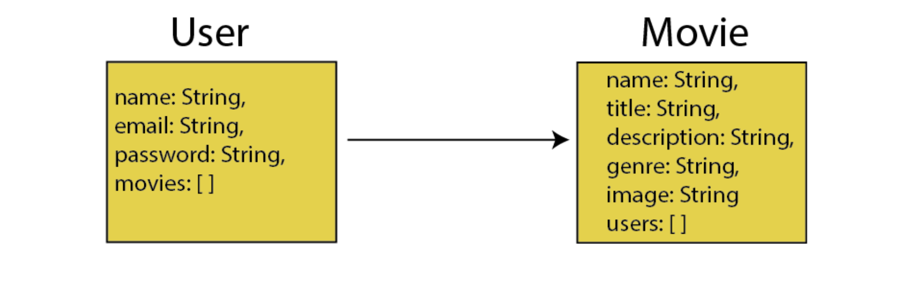

# Movie App

Movie App is a search engine that allows a user to search for movies.\
During the pandemic we all need to continually keep a positive spirit.\
Movie App is a very simple app that allows a user to sign up, edit \
their name, add a movie to the page and remove a movie.

## Heroku link to the hosted working app

[beluga movie client](https://beluga-movie-client.herokuapp.com/).

## Technologies

Mongo\
Express\
React\
Node\
VS Code\
MongoDB Atlas\
CSS\
Button Generator

## Installation steps

Launch the server link in your browser\
[server link](https://beluga-movie-api.herokuapp.com/api/users) .

Second click the client link\
[client link](https://beluga-movie-client.herokuapp.com/) .

## Index:

[deployment](https://facebook.github.io/create-react-app/docs/deployment) for more information.

## User Stories

A user can search for movies.

A user can click the sign up link,\
navigate to the sign up page and sign up.

A user can edit their name on the sign up page.

A user can click the movie link, see a welcome message,\
search for a movie, add a movie and remove the movie.

## Wireframes:

### Landing Page

### Sign Up

### Movie Page

### DB crud interface

## Entity Relationship Diagrams

2 Collections

### Future features

Full crud on both collections, on internal api and external api.
Movie soundtrack playing on landing page.
i18n tabs for Mandarin, Norwegian, Japanese & Spanish.
Build the app in React Native.
Complete authentication build out.
Create test documention for Manual QA Engineers.
Create Automation tests for Automation Test Engineers.
Create unit tests for (SDET) Software Development Engineers in Test.
